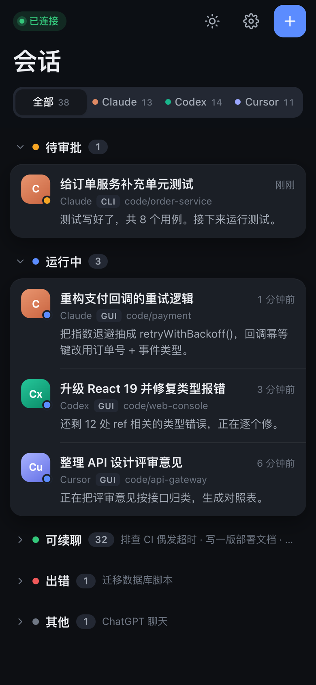
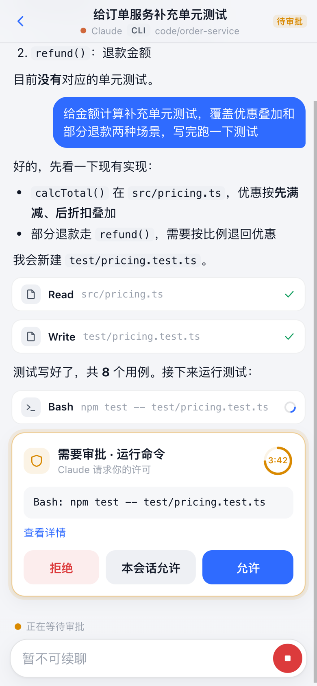
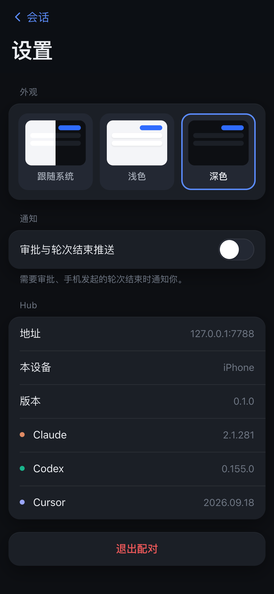
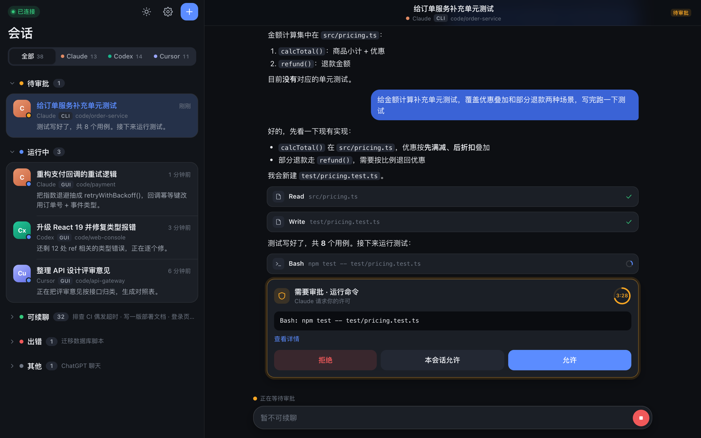
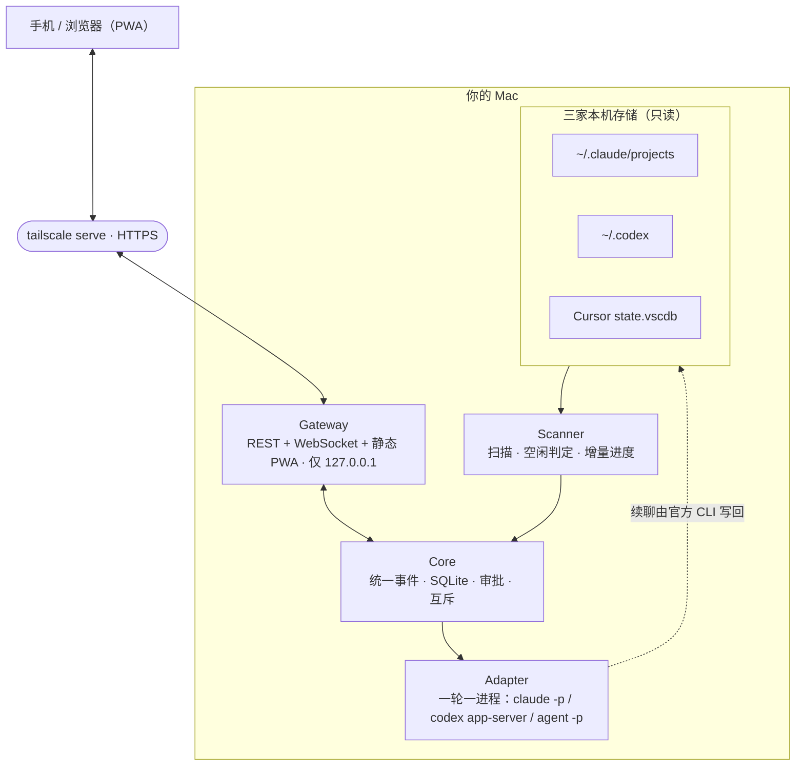
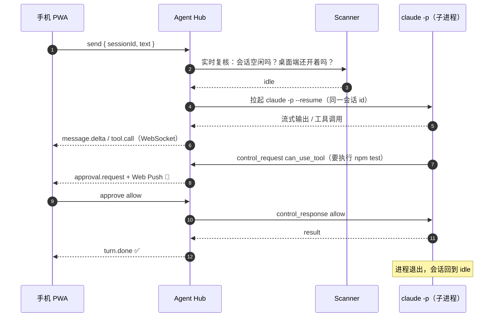

<div align="center">


# Agent Hub

**把 Claude Code、Codex、Cursor 的本机会话装进口袋。**

在手机上查看 Mac 上所有 AI 编程会话的进度、接着聊、一键处理权限审批。<br/>
单进程、跑在你自己的 Mac 上，不经过任何第三方中转。

<p>
  
  
  
  
  
  
  
</p>


</div>

---

## 为什么做这个

同时开着几个 AI 编程助手时，人经常不在电脑前：Claude 卡在一个权限确认上等了半小时，Codex 早就跑完了没人看，Cursor 那边你想补一句话却只能回到座位上。

三家都有各自的远程方案，但彼此不通，而且大多要把会话托管到云端。**Agent Hub 只做一件事**：在你的 Mac 上把三家的本机会话统一成一个列表，通过 Tailscale 私网给手机用。

## 功能

|  |  |
|---|---|
| 🗂️ **三家混排的会话列表** | Claude Code / Codex / Cursor 的会话按「待审批 → 运行中 → 可续聊 → 出错 → 其他」分组，标出来自 GUI、CLI 还是手机 |
| 📡 **实时进度** | 桌面端正在跑的会话，手机上流式看到输出和工具调用 |
| 💬 **空闲后接着聊** | 桌面端停下来后，在手机上对**同一个会话**继续，历史完整保留 |
| 🛡️ **权限审批** | 命令执行、文件写入的审批推到手机，允许 / 拒绝 / 本会话允许，带倒计时 |
| ✨ **新建会话** | 选厂商、选目录、发首句，直接在手机上开新任务 |
| 🔔 **Web Push** | 需要审批、手机发起的轮次结束时推送通知（RFC 8291 / 8292，零依赖实现） |
| 🌗 **浅色 / 深色 / 跟随系统** | iOS 风格界面；手机单栏，电脑左右分栏 |
| 🔒 **本机优先** | 三家存储只读、只监听 127.0.0.1、设备 token 只存哈希、目录白名单 |

## 截图

<table>
  <tr>
    <td width="33%"></td>
    <td width="33%"></td>
    <td width="33%"></td>
  </tr>
  <tr align="center">
    <td>会话列表 · 按状态分组</td>
    <td>详情 · 审批倒计时</td>
    <td>设置 · 主题三档</td>
  </tr>
</table>

<details>
<summary>电脑端浅色主题</summary>
<br/>

</details>

> 截图里的会话都是演示数据。

## 工作原理



- **Scanner** 只读三家的本机存储，产出会话列表、状态和桌面端的进度，**永远不写**。
- **Adapter** 在你从手机发消息时拉起一轮官方 CLI（`claude -p --resume`、`codex app-server`、`agent -p --resume`）续接同一个会话，跑完即退出，不常驻。
- **Core** 把三家的协议归一成同一套事件，落 SQLite，负责审批、互斥（同一会话同时只允许一个 Hub 轮次）和断线补拉。
- **Gateway** 只监听本机地址；手机经 `tailscale serve` 的 HTTPS 访问，没有公网入口，也不经过任何厂商或第三方中转。

<details>
<summary><b>一次手机续聊 + 审批的完整时序</b></summary>



</details>

## 三家支持情况

|  | Claude Code | Codex（ChatGPT App 内置） | Cursor |
|---|:---:|:---:|:---:|
| 会话列表（GUI + CLI） | ✅ | ✅ | ✅ |
| 桌面端实时进度 | ✅ | ✅ | 列表状态 |
| 空闲判定 | 活进程 + 写入静默 | 线程写锁 + rollout | IDE 进程 + composer 状态 |
| 手机续聊 | ✅ | ✅（归档线程自动取消归档） | ✅ |
| 中途权限审批 | ✅ | ✅ | ➖ 无中途审批，沙箱运行，可显式打开 `--force` |
| 新建会话 | ✅ | ✅ | ✅ |

> 所有字段、路径、协议细节都来自本机实测，见 [`docs/spec/01-verified-facts.md`](docs/spec/01-verified-facts.md)；解析器用 [`recordings/`](recordings/) 里的真实事件流回放测试。

## 快速开始

### 需要

- macOS，Node.js **24+**
- 至少装好并登录一家：[Claude Code](https://docs.anthropic.com/claude-code)（`claude`）、[ChatGPT 桌面版](https://chatgpt.com/download)（内置 `codex`）、[Cursor](https://cursor.com) CLI（`agent`）
- 手机访问需要 [Tailscale](https://tailscale.com)（Mac 和手机登录同一账号，免费版即可）

### 1. 安装并启动

```bash
git clone https://github.com/sexylowrie/agent-hub.git && cd agent-hub
npm install && npm run web:install && npm run web:build

cp hub.config.example.json hub.config.json   # 改 allowedCwds：允许在哪些目录新建会话
npm start                                    # http://127.0.0.1:7788
```

### 2. 配对设备

```bash
npm run hub -- pair
# 配对码：482913（5 分钟内有效，一次性）
# 浏览器打开：http://127.0.0.1:7788/#/pair?code=482913
```

打开链接即可在电脑上使用。设备管理：`npm run hub -- devices list`，吊销：`npm run hub -- devices revoke <name>`。

### 3. 手机访问（Tailscale HTTPS）

```bash
bash scripts/tailscale-serve.sh
# 手机访问：https://<你的 Mac>.<tailnet>.ts.net
```

把打印出的地址写进 `hub.config.json` 的 `publicUrl`，之后 `pair` 打印的配对链接就会用它。手机上：

1. 打开 Tailscale App 连上 → Safari 打开上面的地址 → 输入配对码
2. 分享 → **添加到主屏幕**，从图标打开（iOS 只有这样才能收推送）
3. 设置 → 打开「审批与轮次结束推送」

### 4. 常驻（开机自启、崩溃自动拉起）

```bash
bash scripts/install-launchd.sh install     # 装成 LaunchAgent，被杀后 1 秒内拉起
bash scripts/install-launchd.sh status | restart | uninstall
# 日志：~/Library/Logs/agent-hub/hub.log
```

默认接电源时防睡眠（`caffeinate -s`，合盖也能从手机访问），用电池时正常睡眠。

## 配置

`hub.config.json`（从 [`hub.config.example.json`](hub.config.example.json) 复制）：

| 字段 | 默认 | 说明 |
|---|---|---|
| `listen.host` / `listen.port` | `127.0.0.1` / `7788` | 只允许本机或 Tailscale 地址，拒绝 `0.0.0.0` |
| `binaries.claude / codex / cursor` | `claude` / ChatGPT App 内置路径 / `agent` | 三家 CLI 位置 |
| `codex.model` | `gpt-5.5` | 线程自带模型不可用时的回退模型 |
| `allowedCwds` | `["~/code", "~/Projects"]` | 新建会话只能落在这些目录下 |
| `scanner.recentDays` | `30` | 列表只显示最近 N 天的会话 |
| `scanner.idleQuietMs` | `3000 / 5000 / 0` | 文件静默多久才算空闲（宁可误判为运行中） |
| `approval.expireSeconds` | `300` | 审批超时自动拒绝 |
| `publicUrl` | — | 手机访问地址，用于配对链接 |
| `power.keepAwake` | `ac` | `ac` 接电一直防睡眠 / `turn` 仅 Hub 轮次中 / `off` |
| `push.subject` | noreply 邮箱 | Web Push VAPID 联系方式 |

## 安全模型

- **只读三家存储**：`~/.claude/projects`、`~/.codex/*.sqlite`、Cursor `state.vscdb` 都以只读方式打开；续聊由官方 CLI 自己写回。
- **只监听本机**：Gateway 绑定 `127.0.0.1`，手机经 Tailscale 私网 + HTTPS 访问，没有公网端口。
- **设备配对**：6 位一次性配对码，5 分钟过期；设备 token 32 字节随机数，库里只存 `sha256`；可随时吊销。
- **不抢桌面端**：会话在桌面端运行中（或 Codex 线程被 ChatGPT App 持有写锁）时拒绝续聊；同一会话同时只有一个 Hub 轮次。
- **目录白名单**：新建会话的 `cwd` 必须在 `allowedCwds` 内（按真实路径比较）。
- **不碰厂商内部**：不 patch 任何二进制，不用 Chrome DevTools 协议驱动 IDE，不复用厂商的 relay / 远程控制协议。
- **推送加密**：Web Push 按 RFC 8291 端到端加密，推送服务看不到内容。

## 开发

```bash
npm run dev            # tsx watch
npm test               # node:test，Adapter / Scanner 用 recordings/ 回放，不 mock 协议
npm run typecheck      # 后端 + PWA
npm run web:dev        # PWA 开发服务器（/api、/ws 代理到 7788）
npm run record -- claude|codex|cursor    # 录一份新的真实事件流
npm run sanitize       # 录制脱敏（新录制提交前必须跑，--check 只检查）
npm run gen:codex      # 重新生成 Codex app-server 协议 TS 类型
```

<details>
<summary><b>项目结构</b></summary>

```
agent-hub/
├── src/
│   ├── main.ts               # 入口：serve / pair / devices
│   ├── config.ts             # 配置校验、二进制探测
│   ├── power.ts              # 按需 caffeinate
│   ├── core/                 # 统一事件、SQLite、会话与轮次调度（不含任何厂商细节）
│   ├── scanner/              # 三家存储只读扫描、空闲判定、历史
│   ├── adapters/             # 三家 CLI 一轮一进程的续聊 / 新建
│   └── gateway/              # REST、WebSocket、鉴权、Web Push、静态托管
├── web/                      # Vite + Preact PWA
├── recordings/               # 三家真实事件流（已脱敏），测试回放用
├── test/                     # node:test
├── scripts/                  # launchd、tailscale serve、录制、脱敏
└── docs/
    ├── spec/                 # 规格与已验证事实
    ├── research/             # 调研与方案
    └── mockups/              # 设计稿
```

依赖白名单：运行时只有 `hono`、`ws`、`zod`；存储用内置 `node:sqlite`，不引入任何原生编译依赖；PWA 另有 `vite`、`preact`。

</details>

设计文档从 [`docs/spec/00-overview.md`](docs/spec/00-overview.md) 开始读；给 AI 协作者的约定在 [`CLAUDE.md`](CLAUDE.md)（`AGENTS.md` 为同一文件）。

## 常见问题

<details>
<summary><b>Codex 会话一直显示「运行中」，没法续聊？</b></summary>

ChatGPT App 本次运行中打开过的线程会一直持有写锁（切到别的线程也不释放），这时续聊会和 App 抢写同一个线程，Hub 会拒绝。退出 ChatGPT App 后即可续聊。
</details>

<details>
<summary><b>在手机上续聊了 Cursor 会话，IDE 里看不到？</b></summary>

续聊由 `agent` CLI 写到 `~/.cursor/chats`，不回写 IDE 的 `state.vscdb`（Hub 不写厂商存储）。Hub 的会话详情会把两边拼起来显示。
</details>

<details>
<summary><b>iPhone 收不到推送？</b></summary>

iOS 只允许「添加到主屏幕」后从图标打开的网页 App 订阅推送，且必须是 HTTPS（用 `tailscale serve` 的地址，不是 `http://100.x.x.x`）。
</details>

<details>
<summary><b>数据会上传到哪里？</b></summary>

不会上传。会话数据只在你的 Mac 上（`~/Library/Application Support/agent-hub`）；唯一出网的是 Web Push，内容已端到端加密，经 Apple / Google / Mozilla 的推送服务送达。
</details>

<details>
<summary><b>能实时接管桌面端正在跑的会话吗？</b></summary>

不能，这是刻意的非目标：三家都没有正规的接口，强行接管需要 patch 二进制或驱动 GUI。Agent Hub 只在会话空闲后续聊，桌面端运行中时只看进度。
</details>

## 路线图

- [x] Claude Code / Codex / Cursor 三家接入
- [x] PWA：列表、详情、审批、新建、主题、手机与电脑适配
- [x] launchd 常驻、启动对账、按需防睡眠、Web Push
- [ ] 图片 / 附件消息
- [ ] 更多厂商

## 许可证与声明

[MIT](LICENSE) © sunce

本项目为个人开源项目，与 Anthropic、OpenAI、Anysphere（Cursor）均无关联。Claude、Codex、ChatGPT、Cursor 为各自公司的商标。
